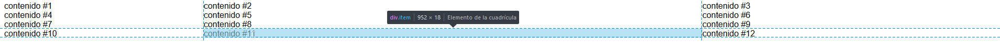
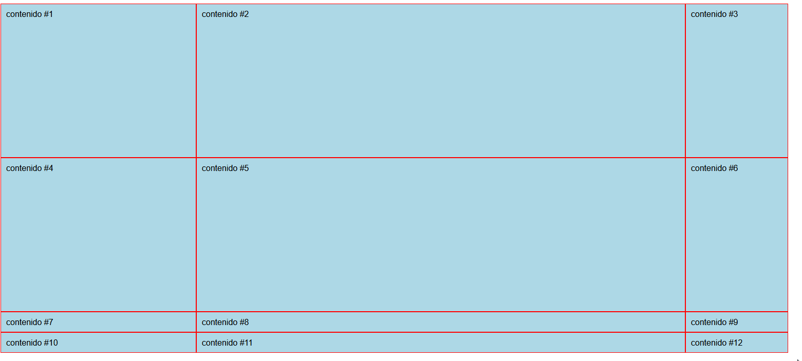

# Curso de CSS Grid Layout

# 1. Propiedades de CSS Grid Layout

## 1.1. Conceptos fundamentales sobre CSS Grid Layout

**Grid Container**: va a ser el elemento padre que va a tener puesto un nuevo tipo de display: grid. Nos permite colocar otras propiedades para manipular nuestro layaout.
**Grid Item**: Son nuestro componentes, contenido, lo que vamos a manejar. Nuestras filas o columnas que vamos a mover a nuestro gusto. Son hijos directos de grid.
**Grid Line**: Lineas divisorias horizontales y verticales.
**Grid Track**: Espacio entre dos líneas adyacentes. Filas y columnas.
**Grid Cell**: Celdas, espacio en dos filas adyacentes y 2 columnas adyacentes.
**Grid Area**: Espacio rodeado por 4 grid lines

## 1.2. Definiendo columnas
En el siguiente código vamos a definir columnas dentro de un grid.

```css
body{
    font-family: Arial;
}

.container{
    display: grid;
    grid-template-columns: 20% 50% 200px;
}
```

```html
<section class="container">
    <div class="item">contenido #1</div>
    <div class="item">contenido #2</div>
    <div class="item">contenido #3</div>
    <div class="item">contenido #4</div>
    <div class="item">contenido #5</div>
    <div class="item">contenido #6</div>
    <div class="item">contenido #7</div>
    <div class="item">contenido #8</div>
    <div class="item">contenido #9</div>
    <div class="item">contenido #10</div>
    <div class="item">contenido #11</div>
    <div class="item">contenido #12</div>
</section>
```

Resultado:



## 1.3. Definiendo filas
Dentro de nuestros grid vamos a tener uno explicito y otro implicito
 - Grid explicito (explicit grid) es cuando nosotros definimos el numero de filas o columnas.
 - Grid implicito (implicit grid) es cuando tenemos filas o columnas que no definimos pero son parte de nuestro grid.

Ejemplo:

```css
body {
    font-family: Arial;
}

.container {
    display: grid;
    grid-template-columns: 20% 50% 200px;
    grid-template-rows: 300px 300px;

    /* grid-template: filas / columnas */
    grid-template: 300px 100px 100px / 50% 100px 100px;
}

.item {
    background-color: lightblue;
    padding: 10px;
    border: 1px solid red;
}
```

```html
<section class="container">
    <div class="item">contenido #1</div>
    <div class="item">contenido #2</div>
    <div class="item">contenido #3</div>
    <div class="item">contenido #4</div>
    <div class="item">contenido #5</div>
    <div class="item">contenido #6</div>
    <div class="item">contenido #7</div>
    <div class="item">contenido #8</div>
    <div class="item">contenido #9</div>
    <div class="item">contenido #10</div>
    <div class="item">contenido #11</div>
    <div class="item">contenido #12</div>
</section>
```

Resultado:
