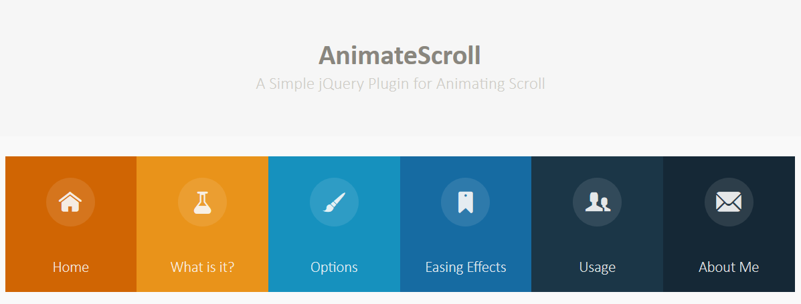

# Curso desarrollo web online

## 1. Introducción al desarrollo web
Para comprender cómo funciona internet necesitamos conocer tres grandes conceptos:
 - Clients (clientes): son los dispositivos a través de los cuales accedemos a los sitios web: un computador desktop, un teléfono, una laptop, etc.
 - Internet: es toda la red formada por servidores y clientes que proveen y consumen contenidos web y se comunican entre sí a nivel global.
 - Server (servidor): es un computador, ubicado en alguna parte de la red, que está prendido todo el tiempo, en el que se alojan o almacenan sitios web y sus recursos y al cual se accede a través de nombres de dominio (.com, .net, .pe, etc.). También se les conoce como hosting.


Profesiones dentro del Desarrollo Web:
- Frontend: son los encargados de cuidar toda la apariencia y experiencia de usuario. Su misión es pasar todo el diseño gráfico de un sitio o aplicación web, a código, y proveer toda la interactividad a los clientes. Esta rama se puede subdividir en algunas especializaciones como: Arquitecto Frontend, Desarrollador JavaScript (frontend), etc.
- Backend: resguardan los datos y la seguridad de las aplicaciones y sitios web. Su misión es crear y mantener toda la parte del sitio web que sucede en los servidores. Pueden especializarse aún más en: SysAdmis, DevOps, Desarrollador JavaScript (backend), entre otros.

Las tres tecnologías básicas que debe conocer y manejar un Frontend son:
- HTML: es el lenguaje de marcado para hacer websites.
- CSS: hojas de estilos cascada, el diseño hecho código.
- JavaScript: es el único lenguaje que funciona actualmente dentro de los navegadores de manera nativa."


## 2. HTML

### 2.1. DOM
DOM es el acrónimo de Document Object Model o Modelo de documento, y es la manera en que se representa el contenido del documento, de manera similar a un árbol de nodos.
A continuación, un ejemplo sencillo de la estructura del DOM:
- html
    - head
        - title
        - meta
    - body
        - header
            - nav
        - section
        - article
    - footer

### 2.2. Etiquetas HTML
Las etiquetas son la representación básica de la información en un documento html. Sirven para crear y organizar el contenido.
La sintaxis general de una etiqueta es:

```html
    <nombre>contenido</nombre>
```

Hay ciertas etiquetas que tienen una sintaxis diferente, ya que se cierran en sí mismas; es decir, no tienen etiqueta de cierre:

```html
    <nombre />
```

Algunas de las etiquetas más conocidas y usadas son:

Etiquetas de cabecera (head):
- doctype: indica al navegador el tipo de documento que se está mostrando
- html: es la etiqueta que envuelve todo el documento
- head: es la cabecera del documento y contiene sub etiquetas que describen al documento o incluyen recursos adicionales.

Etiquetas del cuerpo del documento (body):
- article: diferencia partes del contenido que pueden vivir por sí mismas
- nav: para hacer menús de navegación.
- aside: contenido menos relevante, como publicidad, etc.
- section: sirve para diferenciar las secciones principales del contenido
- header: cabecera del documento.
- footer: pie de página del documento.
- h1 - h6: títulos de nuestro sitio web.
- table: tablas de contenidos, similar a la estructura de las hojas de calculo.
- ul y ol: listas de items.
- div: cualquier división para organizar el contenido.

Existe una página en donde estan todas las etiquetas del html 5 para acceder a ella ve a [ALltags](https://allthetags.com/)

### 2.3. Estructura del sitio web
La estructura html de nuestro proyecto usa una o más de las siguientes etiquetas:
- **h1 a h6**: son etiquetas para indicar títulos con un estilo que destaca del resto.
- **article**: es la parte de nuestro contenido que puede vivir por sí mismo. Pueden haber tantos artícle como proyectos o eventos tenga nuestro portafolio
- **p**: define el texto de un párrafo.
- **small**: aplica una apariencia de texto reducido en tamaño.
- **strong**: aplica al texto un formato de negritas.
- **a**: corresponde a un ancla o enlace a una url interna o externa del documento.
- **img**: con esta etiqueta podemos enlazar imágenes en el documento.
- **figure**: le da un contexto semántico a las imágenes.

### 2.4. Atributos HTML
Los atributos son valores agregados a las etiquetas (tags) html que extienden su habilidad o funcionalidad con información específica.
A continuación, un ejemplo de los atributos más comunes y usados en algunas etiquetas:

**Para img**:
<pre>
- <b>src</b>: específica la ruta de la imagen que será mostrada a través de esta etiqueta. La ruta puede ser absoluta (cunado especifica una dirección exacta, incluyendo el prefijo http(s) ) o relativa (cuando la referencia a la ubicación de la imagen parte de la ubicación del archivo actual).

- <b>alt</b>: indica un texto alternativo que será mostrado en lugar de la imagen cuando ésta no pueda ser mostrada.
- <b>width</b>: ancho de la imagen en pixeles.
- <b>height</b>: alto de la imagen en pixeles.
</pre>

**Para link**, en la cabecera head del documento:
<pre>
- <b>rel</b>: indica la relación del recurso con el contenido.
- <b>type</b>: indica el tipo de recurso / formato.
- <b>href</b>: indica la ubicación (url) del recurso enlazado.
</pre>
**Para meta**, también en la cabecera head del documento:
<pre>
- <b>charset</b>: indica la tabla de caracteres (utf-8 para caracteres latinos) usada en el documento.
</pre>
**Para a**:
<pre>
- <b>href</b>: la ubicación o ruta a la que enlaza esta etiqueta de ancla. En el caso de querer enlazar a elementos que se encuentran dentro del mismo documento, este atributo debe indicar el valor del atributo ““id”” de ese elemento destino del enlace.
</pre>

Existe un generador de Favicons para tener máxima compatibilidad en navegadores y en accesos directos en escritorio.

https://realfavicongenerator.net/

### 2.5. Formularios de contactos
Los Formularios en html son unidades de información que nos permiten recolectar información para enviarlos al propietario del website o a un servicio externo. Esta formado por dos partes o contextos: una parte donde se hace el ingreso y modelación de esos datos (en el frontend), y otra parte que se encarga de enviar, procesar y almacenar esos datos (en el backend).

Los formularios se crean con la etiqueta form. El atributo principal de un formulario es action, ya que contiene la ruta a la que serán enviados los datos recolectados.

Hay diversos elementos html que permiten la captura o recolección de datos, aunque generalmente se usan los elementos creados con la etiqueta input. Los inputs también sirven para crear botones, aunque existe una etiqueta especial para ésto llamada button… El atributo principal de los inputs es type, que indica el tipo de comportamiento o dato que se espera recibir.

Los elementos creados con la etiqueta label muestran un texto que se puede asociar con un input para darle mayor significado al campo, principalmente cuando no se usa el atributo placeholder.

```html
<form>
<label>Nombre</label>
<input type="text" name="nombre" >
</form>
```

### 2.6. Navegación entre las secciones
En esta clase se mostró como hacer una navegacion interna sin js, solo con html. Pero existe la posibilidad de animar la navegación al hacer scroll con ANIMATE SCROLL.

https://plugins.compzets.com/animatescroll/



### 2.8. Formas de agregar CSS a HTML
Hay tres opciones para incluir estilos que definan la apariencia de tu html:

- Estilos en línea: se definen directamente en el elemento html que quieres estilizar, se agregan con el atributo style.
- Estilos con el tag Style: regularmente este tag se incluye dentro de la etiqueta head del html.
- Estilos enlazados desde un archivo css externo: utilizando la etiqueta link que nos permite enlazar recursos externos.

A **CSS**, se le llama **hojas de estilos en cascada** porque los estilos que se definen para una página, se van aplicando de arriba hacia abajo, y de lo más general a lo más particular, teniendo prioridad lo más particular. Esto es, los estilos que prevalecen son los que han sido definidos **en línea**, luego los que fueron definidos mediante la etiqueta **style** en la cabeza o cuerpo del html, y por último los estilos definidos en archivos externos enlazados con la etiqueta **link**. Esta prioridad se puede alterar al usar el modificador **!important"" en la definición de algún estilo en particular, aunque esto no es recomendado.

Les dejo un sitio web que ofrece varias paletas de colores para que encuentren el color perfecto para su proyecto. 

[flatuicolors.com](https://flatuicolors.com/)

### 2.7. Reglas, selectores, declaraciones, propiedades y valores CSS.


- **Reglas**: Las reglas de css estan conformadas de selectores, declaraciones, propiedades y valores.
- **Selectores**: Es la forma con la que vamos a diferenciar las etiquetas HTML de otras
- **Declaraciones**: Es todo lo que hacemos con ese selector, definir color de fondo, align, background, borde, margen, etc.
- **Propiedades**: Son las declaraciones particulares de cada selector.
- **Valores**: generalmente se miden en px, em, etc, mientras que  en otras etiquetas son valores pre definidos.

EJemplo:
```css

#selector { /* SELECTOR POR ID */
    background-color: red;
    margin: 10px;
}

.selector { /* SELECTOR POR CLASE */
    background-color: red;
    margin: 10px;
}

div#selector{
    background-color: red;
    margin: 10px;
}


```

```html
<div id="selector"></div>
<div class="selector"></div>

```

## 3. Estilos Y CSS

### 3.1. Unidades de medida y colores

Hay varias unidades de medida con las que se puede trabajar en CSS: %, em, rem, px, pt, fr, vw, vh
Las medidas más comunes y utilizadas son los pixeles. Un **píxel** es la menor unidad homogénea en color que forma parte de una imagen digital. Es la unidad más práctica y fácil de utilizar y manipular, y es la que utilizaremos mayormente en este curso.

Los colores en CSS pueden ser representados de al menos tres formas diferentes:
- Representados con **palabras claves** para cada color, como: red, green, blue, pink, yellow, black, etc.
- Usando la composición de tres colores **(rojo, verde y azul)**: para esto podemos usar notación hexadecimal o las funciones rgb() y rgba().
- Usando la composición mediante valores de **Matiz, Saturación y Luminosidad** con: hls() y hlsa().

Con respecto a los valores hexadecimales, cada color está representado por 6 digitos, que representan 3 pares de hexadecimales: FF - FF - FF (rojo, verde y azul), en el que cada par puede tomar valores hexadecimales entre 00 y FF. Cada uno equivale a valores decimales entre 0 y 255, donde 0 es la ausencia de ese color y 255 la mayor cantidad disponible. De esta manera cada color se forma por la combinación de diferentes proporciones de rojo, verde y azul.
- #000000 es equivalente a Negro
- #FF0000 es equivalente a Rojo
- #00FF00 es equivalente a Verde
- #0000FF es equivalente a Azul
- #FFFFFF es equivalente a Blanco

### 3.2. Tipos de textos personalizados
Los tipos de texto, también conocidos como **tipos de letras o fuentes**, son el conjunto de diseños tipográficos que representan a cada una de las letras y los caracteres gráficos en el documento. Su nombre correcto es **tipografía**. Los diferentes tipos de fuente están basados en archivos que existen en cada sistema operativo.

Algunos ejemplos de **tipos de texto** o fuentes, son:
- Arial
- Times New Roman
- Verdana
- DeJaVu
- Lato
- OpenSans
- Roboto

CSS permite utilizar **fuentes** diferentes a las disponibles en el sistema operativo del cliente mediante la importación o el enlace a archivos de fuentes externas. Las más usadas son las que están disponibles a través del sitio web de **Google Fonts.**

Al definir el tipo de texto asociado a una clase css con la propiedad **font-family** indicamos al navegador que debe intentar usar esa fuente en particular para darle la apariencia tipográfica a los textos de ese elemento html.

Aquí vamos a mostrar como agregar una fuente en css_
```css
body{
    /* VA A BUSCAR UN ESTILO DE FUENTE ARIAL, SI NO LO ENCUENTRA VA A BUSCAR HELVETICA Y ASÍ SUCESIVAMENTE */
    font-family: Arial, Helvetica, sans-serif;
}

h1{
    /* SI EL ESTILO DE TEXTO TIENE MAS DE DOS PALABRAS SEPARADAS, TENDREMOS QUE AGREGAR COMILLAS */
    font-family: 'Times New Roman', Times, serif;

}
```

Como incluir fuentes que no estan en nuestros sistemas:
- Antes que todo, podemos visitar  y rescatar las fuentes que mas nos gusten y que esten gratis.
- Seleccionamos la fuente y nos muestra dos formas de importar los estilos, una es mediante la etiqueta link y el otro es a travez de un import de css
- Vamos a ocupar las dos

```html
<html>
    <head>
    ...
    <link href="https://fonts.googleapis.com/css2?family=Orbitron:wght@400;500;600;700;800;900&display=swap" rel="stylesheet">
    
    </head>
</html>
```

```css
@import url('https://fonts.googleapis.com/css2?family=Orbitron:wght@400;500;600;700;800;900&display=swap');


body{
    font-family: 'Orbitron', sans-serif;
}

```

Ademas aquí vamos a dejar una imagen extraida en los comentarios del curso en platzi, los 10 tipos de fuentes mas usados en la web en los últimos 10 años.


### 3.3. Propiedades para los textos 
Además de todas las propiedades comunes que comparten los elementos estándar de html, como: display, position, margin, padding, top, left, right, bottom, border, etc., los elementos que admiten contenidos textuales aceptan una serie particular de propiedades entre las que se encuentran las siguientes:
- **font-family**: define el tipo de fuente aplicado al texto.
- **color**: define el colore del texto.
- **line-height**: define la altura desde la base del texto hasta la base de la siguiente línea de texto.
- **font-size**: define el tamaño del texto, admite cualquiera de las unidades de medida disponibles.
- **letter-spacing**: define el espaciado entre las letras del texto.
- **font-weight**: define el ““peso”” de la letra, negrita, normal, light y normalmente se indica en múltiplos de 100 o usando keywords.
- **text-decoration**: define el decorado del texto como subrayado, tachado, con subrayado superior, etc.
- **text-transform**: permite transformar el estado de mayúsculas / minúsculas en el texto, usando uppercase para mayúsculas sostenidas, lowercase para minúsculas sostenidas, etc.

### 3.4. Backgrounds de color e imagen
Algunas de las propiedades de css relacionadas con la apariencia del fondo de los elementos son:

- **background**: con la que se puede indicar un color, o usada de manera extendida, puede incluir color de fondo, url de la imagen, posición y modo de repetición de la imagen.
- **background-image**: contiene la url que se usará como fondo del elemento.
- **background-color**: indica el color de fondo, se puede usar en combinación con la imagen.
- **background-size**: se puede indicar en valores de alto y ancho o en alguna de las palabras claves - permitidas: cover o contain.
- **background-position**: indica la posición de la imagen dentro del elemento, puede indicarse en - unidades o en palabras claves como center, left, top y right.
- **background-repeat**: indica el método de repetición de la imagen de fondo, puede ser: repeat, - repeat-x, repeat-y o no-repeat.

### 3.5. Bordes

Todos los elementos html admiten la propiedad de css border, que define la apariencia que tendrá el contorno del componente.
El borde puede ser de muchos estilos, y al igual que las propiedades margin y padding que aprenderás más adelante, a los bordes se les puede colocar estilos tanto de forma general con la propiedad border, como de acuerdo al lado del elemento que se indique: border-top, border-right, border-bottom y border-left.

Con la propiedad boder-radius se define el redondeado de las esquinas de los bordes.

[Algunos ejemplos de bordes](http://www.siteraw.com/html-css/how-to-create-a-website/borders-shadows#borders)


### 3.6. Márgenes

Los márgenes en CSS son el espacio que separa a los elementos html entre sí. Hay elementos de html que traen márgenes predefinidos (por defecto) en los estilos propios del navegador como el caso de: body, h1, h2, h3, h4, h5, h6, ol, ul, li, p, y muchos otros.

Cuando hay dos márgenes de elementos diferentes que colindan entre sí, se presenta una situación llamada ““margin collapsing”” en la que el mayor margen de los dos se superpone al otro.

Se puede asignar una medida de margin para los cuatro lados del elemento, o márgenes individuales para cada uno de los lados con: margin-top, margin-right, margin-bottom y margin-left.

Se puede centrar un elemento html colocándole el valor de margin: 0 auto, cuando dicho elemento tiene display block.


### 3.7. Padding
Así como el margen separa a los elementos html entre sí, la propiedad padding de relleno, permite definir una separación entre el contenido interno y el borde de un elemento.

Al inspeccionar los elementos html en el navegador, se puede apreciar el margin con color naranja y el padding con color verde.

Una forma de identificar cuándo es mejor usar margin o padding en un elemento, es evaluando la necesidad de usar borde o background, ya que son éstos: el borde y el background, los que realmente diferencian el uso de uno u otro.

[Ejemplo rellenos](http://www.siteraw.com/html-css/how-to-create-a-website/css-box-model#margins)


